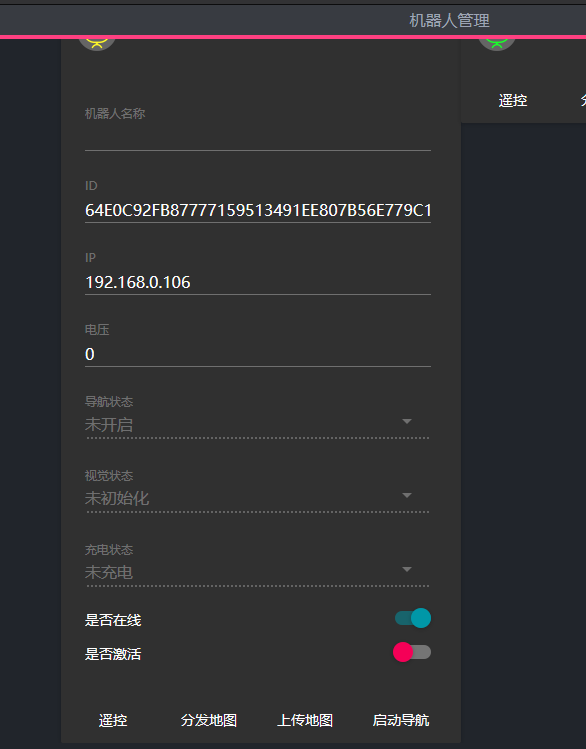
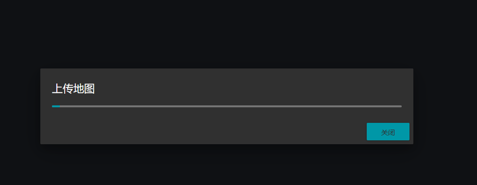
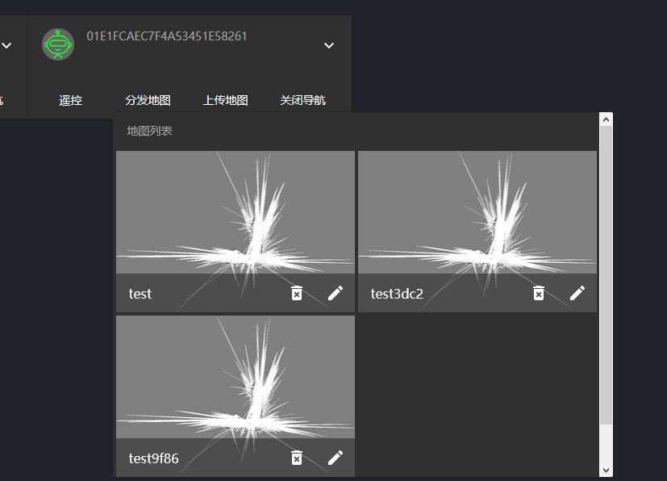
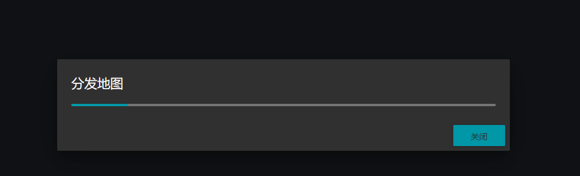
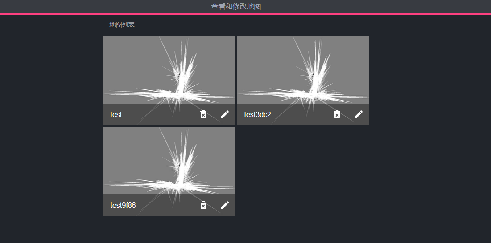

# 创建和上传地图

## 创建地图

创建地图使用伽利略导航客户端。具体的地图创建方法参考[伽利略导航客户端手册](https://doc.bwbot.org/en/books-online/galileo-servicebot-doc/)

地图创建完成后即可关闭伽利略客户端。

## 激活机器人

在调度系统主界面中，点击左侧的机器人按钮。此时主界面中会显示当前局域网内的机器人。

其中灰色代表不在线的机器人。黄色表示未激活的机器人。绿色表示已经激活的机器人。机器人只有在激活后才能被调度系统控制管理。

点击向下的三角，展开机器人控制面板

点击下面的是否激活状态按钮。此时机器人即被激活了。

## 上传地图

点击机器人上传地图按钮即开始上传。上传地图时会把机器人之前创建的地图上传到服务器中。

## 分发地图

点击机器人面板中的分发地图即可分发地图。分发地图时会将地图从服务器复制到目标机器人，用于机器人之间共享地图。

从地图中选择要分发的地图。

等待分发地图完成

## 查看地图

地图上传完成后可以通过地图查看面板查看地图。点击左侧的地图管理选项，然后选择查看和修改。

界面中会列出当前服务器中所有的地图。你可以点击对应的按钮进行删除和重命名操作。
