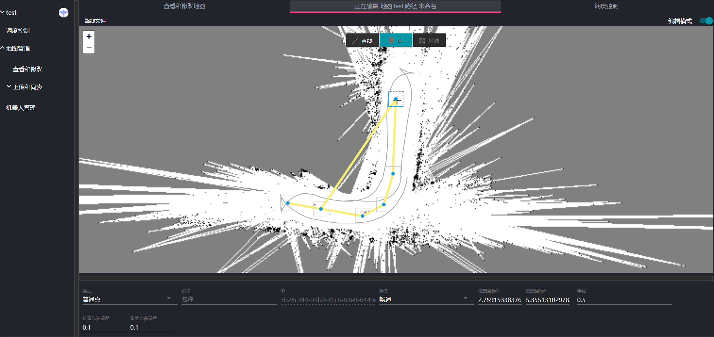
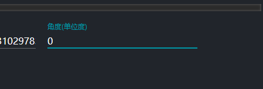
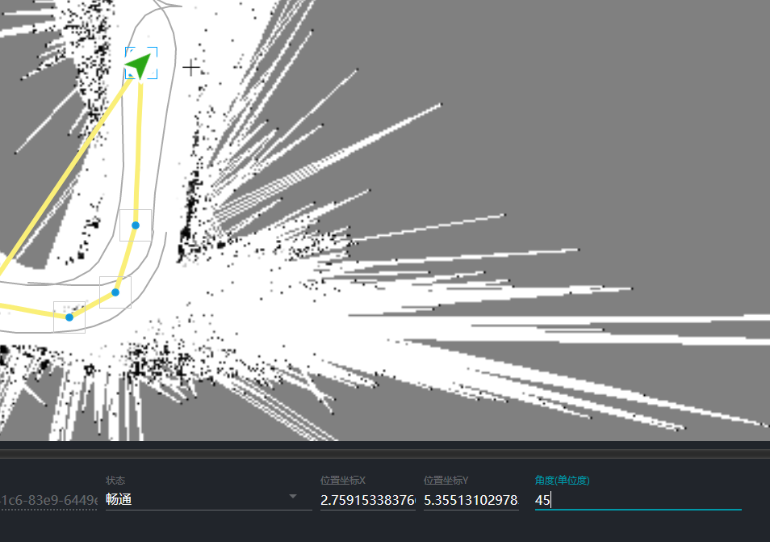

# 绘制地图路网

点击左侧的地图管理菜单，然后点击查看和修改菜单，打开查看和修改地图面板。此时面板会显示当前服务器中的所有地图。

点击自己要绘制路网信息的地图，进入路网编辑面板。

界面中的地图即为机器人创建的地图，我们现在需要在此地图上绘制机器人能够走的路线。同时标定机器人待机点和机器人充电点等等。

点击右上角的编辑模式按钮进入编辑模式

鼠标拖动可以移动地图。鼠标滚轴进行地图缩放。

中上方的按钮为绘图工具按钮。通过点击对应的工具可以绘制直线或者点。
地图上灰色的路线为创建地图时机器人所行走的路径。可以作为绘制路径的位置参考。

## 直线工具

点击中间上方的直线工具，进入绘制直线的状态。

点击地图中的一个点作为起点，此时移动鼠标，会发现一条黄色的线跟随鼠标移动。

之后依次点击地图上的点绘制路径。最后可以按键盘ESC键结束绘图。

如果想要接上之前绘制的直线，只需要点击之前绘制的直线中的端点然后就可以继续以同样的方式绘图了。

如果想要删除直线，只需要在目标线段上点击右键。此时会弹出一个删除菜单，点击删除菜单即可删除对应线段。

如果想在之前绘制的线段中间连出新的一段线段，可以直接在线段上想要插入的位置点击鼠标（注意要在鼠标变成小手的形状后才点击，否则新插入的点不在线上）。

## 点工具

点工具用于在目标位置添加点。比如可以用于设置充电桩位置，待机点位置等等。

### 设置点的属性

路网中的点有时具有特殊的意义。比如充电位置，待机位置等等。我们可以通过点工具选中想要设置的点，然后在底部属性面板中编辑点的属性。点被选中后其边框会变成蓝色。

下面以设置充电桩位置为例子介绍

在点类型中选择充电点

由于充电桩有特定的方向，我们需要设置充电桩的正确角度后机器人才能成功的自动充电。通过修改底部面板角度值，设置充电桩角度。

可以看到我们在把角度设置成45°之后地图中的充电桩角度也跟着变化。

## 区域工具

此工具暂未开放

### 保存路网信息

地图绘制完成后点击左上角的路径文件菜单。

根据提示进行操作即可保存。

这里我们保存成path

至此路网信息绘制完成。
