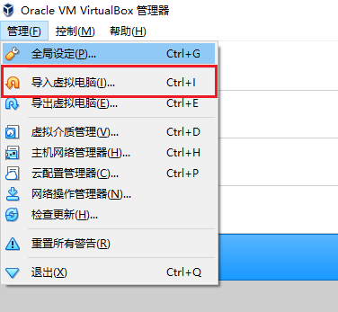
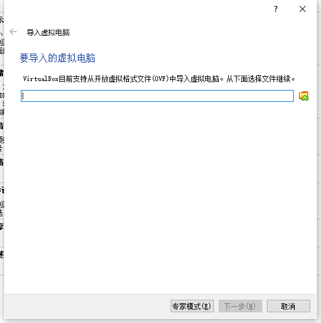
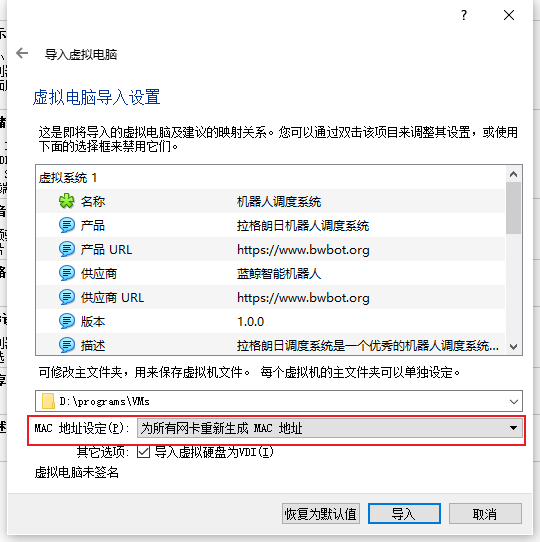
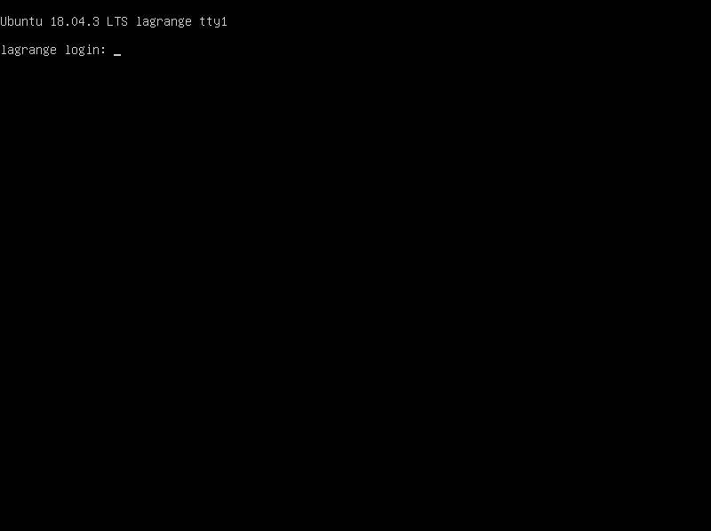
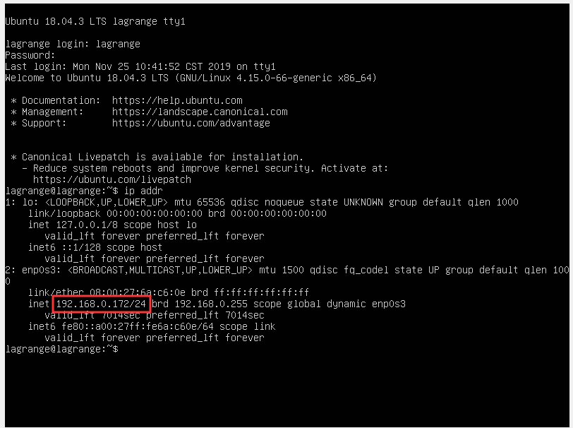

# 安装

从[此处](https://bwbot.org/s/mF9eSf)下载调度系统服务程序

安装[Virtualbox](https://www.virtualbox.org/wiki/Downloads)

安装完成后导入之前下载的调度系统服务程序

继续导入设置，注意网卡部分要按照图中设置。

等待导入完成，之后选择导入的虚拟机然后点击显示

等待虚拟机启动完成

使用用户名 lagrange 密码 lagrange登录。登录进入后执行 `ip addr` 获取虚拟机ip

从输出中获取到服务器ip。比如上图中的服务器ip为192.168.0.172

在自己的浏览器中输入 `http://192.168.0.172:24958` 即可打开调度系统控制页面。

在获取到ip后为了方便以后使用可以到路由器设置页面中把虚拟的ip设置成固定ip。

以后就可以打开虚拟机直接使用了，不需要再获取虚拟机ip。
