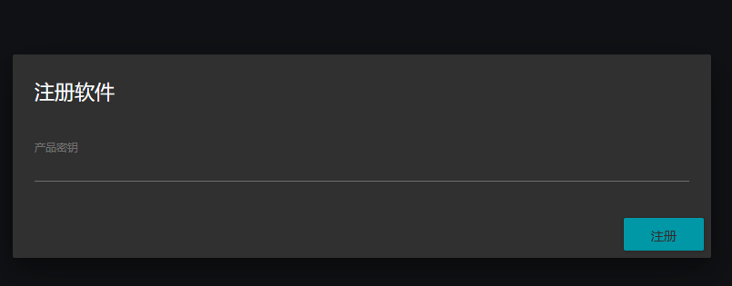
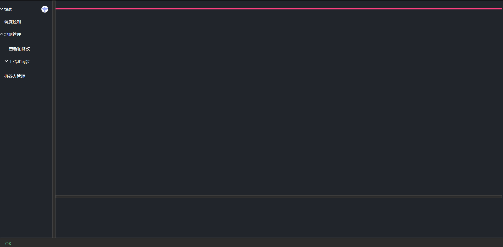
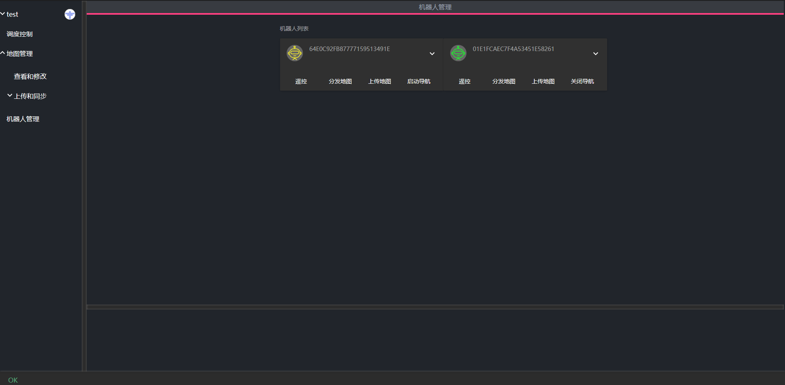
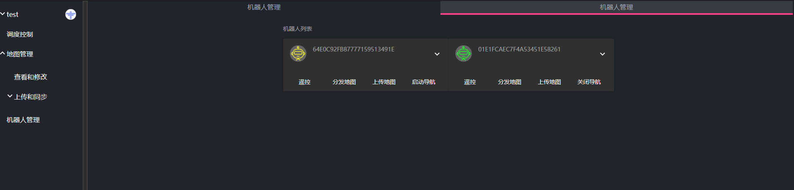

# 调度系统界面简介

## 调度系统软件注册

首次使用时请保证服务器能够正常访问网络

在用户登录后如果软件未注册则会提示注册信息，如下图所示。

输入产品密钥字符串，然后点击注册按钮，等待注册完成。

## 系统主界面介绍

系统左侧为菜单栏。可以点击对应的菜单开启不同的功能面板。右侧的大块面板区域为主面板区。用于显示不同的功能面板。下方为底部面板，用于改变选择目标的属性和发布任务。

## 基础操作

打开和关闭面板

点击对应的左侧菜单会打开不同的面板，比如点击机器人管理后会如下显示

再次点击左侧菜单可以再次打开一个面板。多个面板可以同时打开，且相互独立。

鼠标移动到面板标题栏的时候会显示关闭按钮，点击关闭按钮即可关闭对应面板。

