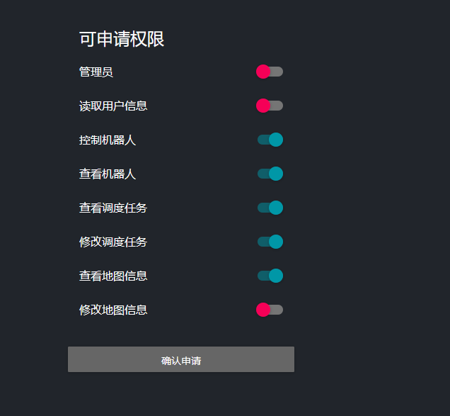
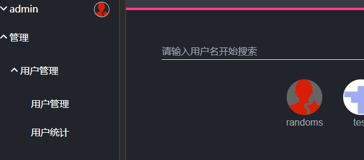
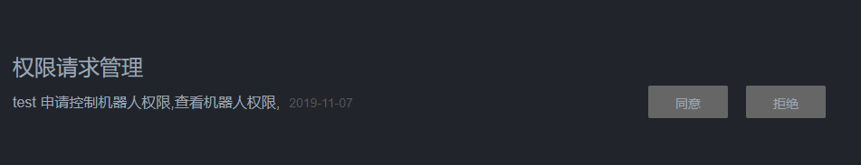

# 用户注册

当首次打开调度系统页面时系统会自动跳转到登录界面。默认的管理员账号密码为admin。请登录后及时修改密码。

如果没有账号要先注册账号。点击注册按钮开始注册用户。普通用户注册后需要向管理员申请权限才能够进行对应操作。

注册完成后会自动跳转到登录界面，在输入用户名和按钮后点击登录按钮即可登录。

## 权限管理

普通用户在进行不同的操作之前要获取对应的权限。权限可以向管理员申请。

### 申请权限

点击左侧用户菜单中的权限申请打开权限申请面板。

点击自己需要的权限然后点击确认申请按钮即可申请权限。确认后管理员会收到用户的权限请求信息。当管理员同意后对应用户即可获得权限。

### 管理权限申请

管理员登录后，左侧菜单栏会出现用户管理菜单

点击权限管理菜单，打开权限管理面板。此时会显示用户的权限申请请求。

点击同意或拒绝按钮即可完成对权限申请操作。
