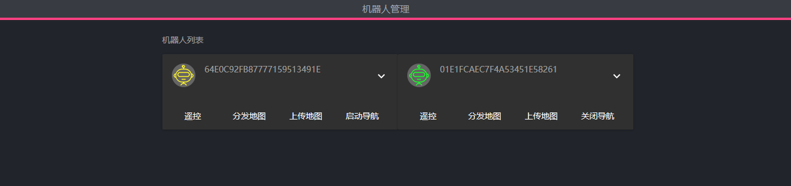
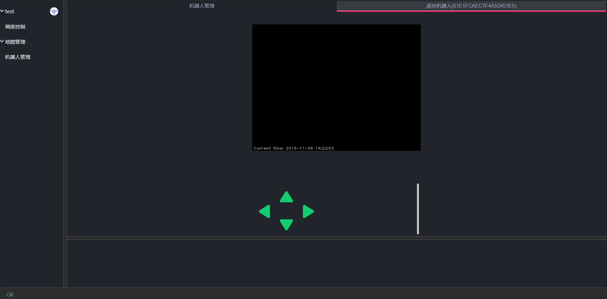
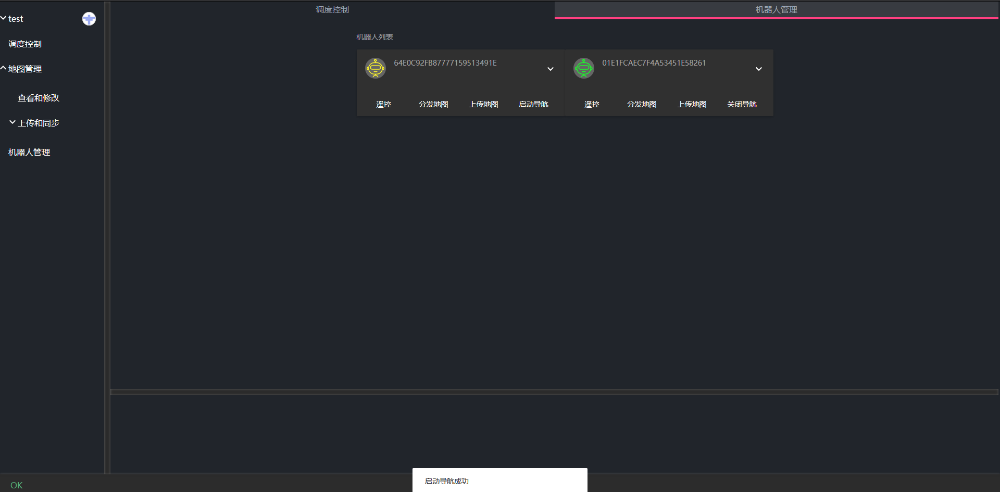

# 机器操控

调度系统提供了简单的机器人手动控制功能，用于更加方便的处理一些异常情况。

点击左侧的机器人管理菜单，打开机器人控制面板。

在创建地图说明中我们已经介绍了如果激活机器人。下面介绍遥控和启动导航功能功能。

## 遥控机器人

点击需要遥控的机器人的遥控按钮，此时会打开机器人遥控面板。

中间图像为机器人图传图像。点击左下角方向键可以控制机器人前进后退左转右转。也可以通过 WSAD 按钮控制对应方向。上下箭头控制机器人移动速度。右下角的色条显示当前机器人的速度档位。

***注意当遥控机器人面板在后台时遥控仍然有效。只有遥控面板被关闭时才会停止遥控***

我们可以利用这个功能边进行其他操作边进行遥控。

## 控制机器人导航

在导航系统已经开启，但机器人尚未开启导航程序时。我们可以利用开启导航按钮开启机器人导航。

点击导航按钮等待提示启动导航成功。如果启动失败系统也会提示对应的失败原因。

同样在机器人处于导航状态下时我们也可以点击关闭导航按钮，关闭机器人导航功能。

***注意当启动调度系统时，调度系统会自动启动所有激活的机器人的导航程序。同样在关闭调度系统时，系统也会自动关闭所有激活机器人的导航程序。***
