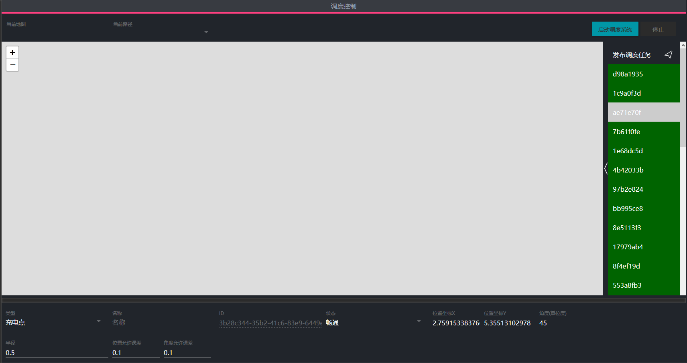
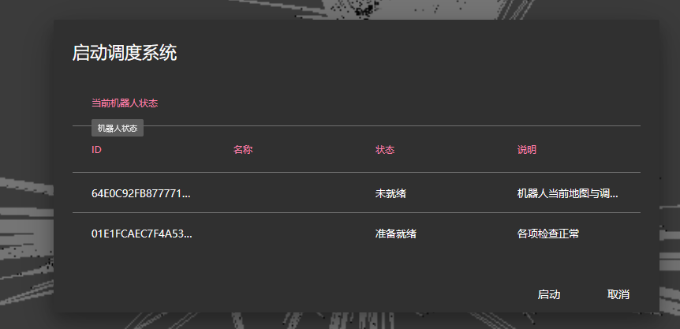
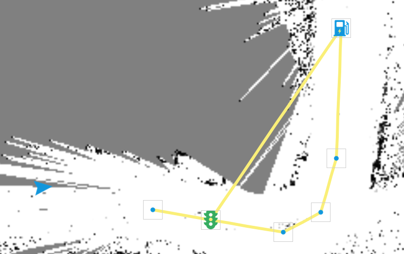

# 调度系统控制

## 调度系统控制界面介绍

调度空控制主界面如下图所示

其中最上部为选择地图和导航路径的区域。右侧按钮可以控制启动和关闭导航系统。

中间大片空白区域是地图显示区域。可以试试显示当前调度系统中地图和各个机器人状态。

右侧边栏显示当前调度任务状态。

底部面板显示选择的对象的属性。同时可以用来发布新的调度任务

## 调度系统启动与关闭

### 开启调度系统

在最上方的选择地图和路径选择菜单中选择目标导航地图和路径。

此时中间地图区域会显示当前的地图和路网信息。

点击右侧启动调度系统按钮，此时会弹出调度系统自检信息。根据提示查看各机器人状态

其中显示准备就绪的机器人会在启动调度系统之后自动进入工作状态。之后发布调度任务后机器人可以正常执行任务。未准备就绪的机器人调度系统将不会对其分配任务。

在点击确认开启导航系统之后可以发现地图中出现蓝色箭头。此箭头代表机器人当前位置。

### 关闭调度系统

点击右上角停止按钮即可关闭调度系统
