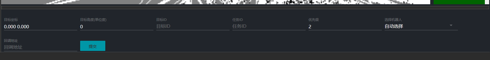
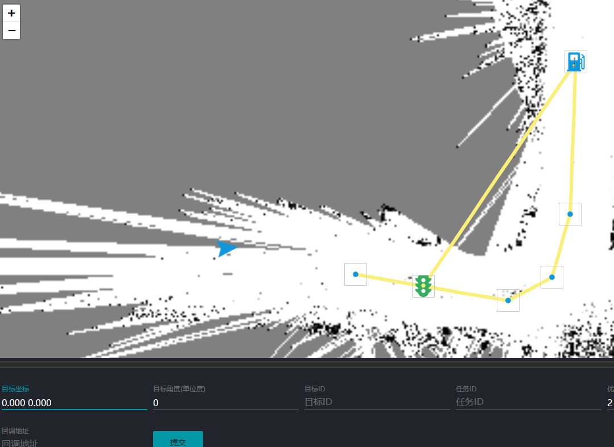
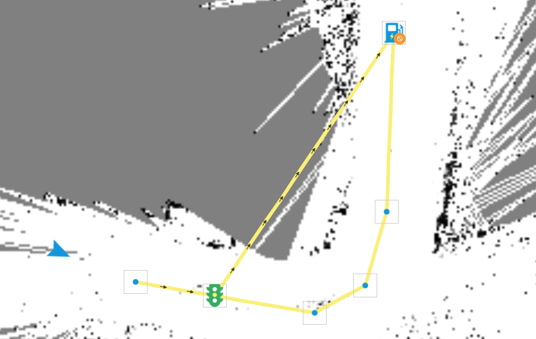
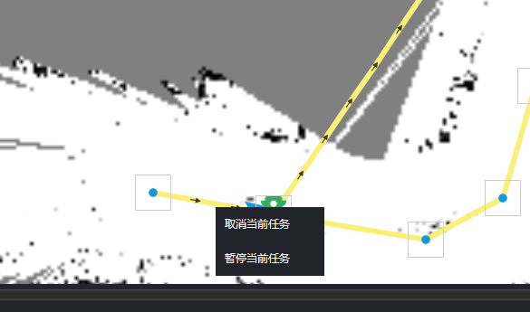
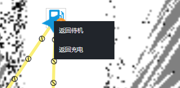

# 调度任务管理

一个调度任务就是控制某个机器人移动到某个位置然后完成某动作。我们可以通过系统界面方便的发布调度任务。

## 发布调度任务

在启动调度系统之后，点击右侧的发布调度任务按钮。此时底部面板会变成调度任务发布面板。

在设置好对应的任务信息之后，点击提交按钮。调度任务就会被添加到系统的队列之中。

比如现在我们想要机器人移动到最上方的充电桩位置。首先点击底部面板最左边的目标坐标文本框，然后在地图上点击充电桩所在位置。

点击后点击提交按钮，如果一切正常，现在机器人就会自动向目标点移动了。

其中带箭头的路线即为调度系统为机器人机器人分配的路线。

## 取消调度任务

在机器人执行调度任务的时候，右侧的调度状态栏会显示当前执行的任务。点击其中的取消按钮即可取消任务。

如果需要取消机器人当前执行的任务，也可以右键点击地图上的机器人图标。在弹出的菜单中选择取消当前任务

## 暂停和继续调度任务

暂停和继续任务的操作方式和取消任务类似，也是点击右侧的调度任务状态按钮。当任务处于不同的状态时会显示出不同的颜色。

## 返回待机

当机器人处于空闲状态时，可以右键点击机器人图标在弹出的菜单中选择返回待机选项

## 返回充电

同样如果需要机器人返回充电，也可以右键点击机器人图标，选择菜单中的返回充电按钮。
